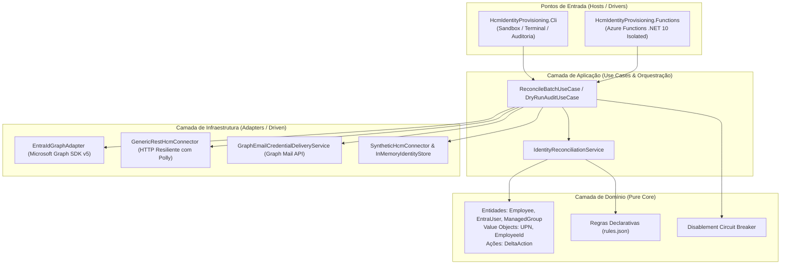

# HCM to Microsoft Entra ID Provisioning & Identity Lifecycle Automation

[](https://dotnet.microsoft.com/)
[](https://docs.microsoft.com/dotnet/csharp/)
[](https://learn.microsoft.com/azure/azure-functions/)
[](https://learn.microsoft.com/graph/)
[](tests/)

Motor corporativo de governança e automação do ciclo de vida de identidades (**IAM / IGA / ILM**) que sincroniza os colaboradores de sistemas de Recursos Humanos / HCM (Human Capital Management) com o **Microsoft Entra ID** (antigo Azure AD).

Projetado sob os princípios de **Clean Architecture**, **Hexagonal Architecture (Ports & Adapters)** e **Domain-Driven Design (DDD)**, o projeto é **100% compatível com o plano Microsoft Entra ID Free** — dispensando a necessidade de licenças premium (P1/P2 ou Microsoft Entra Governance) para provisionamento automatizado de usuários e atribuição dinâmica de grupos baseada em regras de negócio.

---

## 📑 Sumário

- [1. Visão Geral & Objetivos](#1-visão-geral--objetivos)
- [2. Arquitetura & Funcionamento do Motor](#2-arquitetura--funcionamento-do-motor)
  - [2.1 Princípio de Reconciliação Declarativa](#21-princípio-de-reconciliação-declarativa)
  - [2.2 Fluxos do Ciclo de Vida (Joiner, Mover, Leaver)](#22-fluxos-do-ciclo-de-vida-joiner-mover-leaver)
  - [2.3 Fronteira de Grupos Gerenciados (Zero Blast Radius)](#23-fronteira-de-grupos-gerenciados-zero-blast-radius)
  - [2.4 Disablement Circuit Breaker](#24-disablement-circuit-breaker)
  - [2.5 Entrega Out-of-Band de Credenciais via Shared Mailbox](#25-entrega-out-of-band-de-credenciais-via-shared-mailbox)
- [3. Estrutura da Solução](#3-estrutura-da-solução)
- [4. Guia para Novos Desenvolvedores (Ambiente Local)](#4-guia-para-novos-desenvolvedores-ambiente-local)
  - [4.1 Pré-requisitos](#41-pré-requisitos)
  - [4.2 Compilação & Testes](#42-compilação--testes)
  - [4.3 Executando o CLI Sandbox (Modo Offline)](#43-executando-o-cli-sandbox-modo-offline)
  - [4.4 Estendendo e Adicionando Novos Conectores HCM](#44-estendendo-e-adicionando-novos-conectores-hcm)
- [5. Guia de Implantação & Deployment (Azure Cloud)](#5-guia-de-implantação--deployment-azure-cloud)
  - [5.1 Pré-requisitos no Azure & Microsoft 365](#51-pré-requisitos-no-azure--microsoft-365)
  - [5.2 Configuração da Shared Mailbox & Política de Menor Privilégio](#52-configuração-da-shared-mailbox--política-de-menor-privilégio)
  - [5.3 Configuração do Azure Functions App](#53-configuração-do-azure-functions-app)
  - [5.4 Disparo Manual e Diagnósticos](#54-disparo-manual-e-diagnósticos)
  - [5.5 Observabilidade & Monitoramento (Application Insights)](#55-observabilidade--monitoramento-application-insights)

---

## 1. Visão Geral & Objetivos

### Contexto & Motivação
No ecossistema corporativo da Microsoft, o [provisionamento de identidades orientado a RH (HR-driven / Inbound User Provisioning)](https://learn.microsoft.com/entra/identity/app-provisioning/user-provisioning) é a abordagem recomendada para governança de ciclo de vida de identidades (*Identity Lifecycle Management - ILM*). No entanto, os recursos nativos do Microsoft Entra ID exigem planos de licenciamento corporativos avançados (**Microsoft Entra ID P1, P2 ou Microsoft Entra ID Governance**), tornando a automação proibitiva para organizações que utilizam o plano **Microsoft Entra ID Free**.

Este projeto é uma **alternativa open-source, desacoplada e auto-hospedada** para automação e reconciliação de identidades, projetada especificamente para engenheiros de IAM (*Identity & Access Management*) e profissionais de cibersegurança que buscam controle total sobre suas políticas sem *vendor lock-in*.

### Objetivo do Sistema
Atuar como um **motor autoritativo de governança de ciclo de vida e reconciliação contínua**, conectando sistemas de RH (HCM) ao **Microsoft Entra ID Free** via Microsoft Graph API, garantindo conformidade, segurança e zero intervenção manual no gerenciamento de contas e grupos.

### Cobertura do Ciclo de Vida (JML)
O motor automatiza os três eventos canônicos de governança de identidades:

- **Joiners (Onboarding):** Provisionamento automático de contas no diretório para colaboradores ativos no RH, padronização de UPN (sanitização de caracteres e resolução determinística de colisões/homônimos), atribuição de grupos por regras e entrega out-of-band da senha temporária inicial.
- **Movers (Transições & Mudanças):** Sincronização contínua de atributos organizacionais e reconciliação dinâmica de permissões — concedendo os novos grupos necessários e revogando grupos antigos para mitigar o acúmulo de privilégios (*access creep*).
- **Leavers (Offboarding):** Bloqueio imediato da conta (`accountEnabled = false`), invalidação instantânea de sessões e tokens ativos (`revokeSignInSessions`) e remoção de todos os acessos em grupos gerenciados, mantendo o objeto desabilitado para retenção e auditoria.

---

## 2. Arquitetura & Funcionamento do Motor

A solução segue estritamente a **Clean Architecture**, onde o domínio central e as regras de negócio não conhecem APIs externas, SDKs da nuvem ou detalhes de I/O.



### 2.1 Princípio de Reconciliação Declarativa

A aplicação rejeita scripts procedurais imperativos (*"leia funcionário X -> chame Graph"*). Em vez disso, opera por **reconciliação de estado contínuo**:

$$\text{Dados do HCM} \xrightarrow{\text{Rules Engine}} \text{Estado Desejado} \iff \text{Estado Atual do Entra ID} \implies \text{Idempotent Delta ChangeSet}$$

1. Ingestão em lotes paginados da base de RH.
2. Cálculo em memória do **Estado Desejado** do colaborador (contas e grupos) avaliado contra o motor de regras declarativo (`rules.json`).
3. Consulta em lote ao Microsoft Entra ID (`$filter=employeeId in (...)`).
4. Comparação pura e geração de um conjunto delta de mutações (`DeltaAction`).
5. Avaliação do Circuit Breaker de segurança.
6. Aplicação das mutações via Microsoft Graph Batching (até 20 requisições por pacote OData).

### 2.2 Fluxos do Ciclo de Vida (Joiner, Mover, Leaver)

| Evento de RH | Condição Detectada | Ações do Motor |
| :--- | :--- | :--- |
| **Joiner** *(Entrada)* | Ativo no HCM e ausente no Entra ID | 1. Sanitiza UPN (remove acentos, resolve colisões de homônimos adicionando sufixo incremental).<br>2. Gera senha inicial criptográfica (CSPRNG, 24 caracteres).<br>3. Cria usuário com flag `forceChangePasswordNextSignIn = true`.<br>4. Atribui grupos de segurança conforme regras do departamento/cargo.<br>5. Envia credencial out-of-band via e-mail configurado. |
| **Mover** *(Mudança)* | Ativo no HCM e existente no Entra ID | 1. Atualiza nome de exibição caso tenha sido retificado.<br>2. Recalcula grupos desejados para o novo cargo/setor.<br>3. Adiciona usuário aos novos grupos gerenciados.<br>4. Remove usuário dos grupos antigos que não se aplicam mais. |
| **Leaver** *(Desligamento)* | Inativo/Demitido no HCM e ativo no Entra ID | 1. Bloqueia imediatamente o login (`accountEnabled = false`).<br>2. Invalida imediatamente tokens ativos (`revokeSignInSessions`).<br>3. Purga todos os acessos dos grupos dentro do escopo gerenciado.<br>4. Preserva a conta desabilitada para políticas de retenção/auditoria. |

### 2.3 Fronteira de Grupos Gerenciados (Zero Blast Radius)

Para garantir que grupos administrativos, equipes do Teams e grupos ad-hoc criados manualmente na empresa nunca sejam afetados pela automação:
- O motor define uma fronteira estrita de grupos (`ManagedGroupScope`), configurada por prefixo (ex: `grp-iam-*`) ou declarada no `rules.json`.
- O reconciliador **jamais remove** nenhum usuário de grupos fora desse escopo (ex: `All-Company`, `Diretoria`, `SG-AzureAdmins` permanecem intactos).
- Caso uma regra aponte para um grupo que ainda não foi pré-criado no diretório, o motor emite um alerta estruturado (`WARNING_MANAGED_GROUP_NOT_FOUND`) e prossegue com a conciliação do restante do colaborador sem abortar o processo.

### 2.4 Disablement Circuit Breaker

Para impedir incidentes catastróficos caso uma falha no sistema de RH retorne um lote com colaboradores indevidamente marcados como inativos ou uma base vazia:
- O `ICircuitBreaker` monitora o volume de desativações em cada lote.
- Se o percentual ultrapassar o limiar de segurança (padrão: `10%`) **OU** a contagem bruta de exclusões exceder o limite (padrão: `25` contas):
  - O disjuntor **dispara** (`CRITICAL_AUDIT_BREAKER_TRIPPED`).
  - Todas as ações destrutivas (`DisableAccountAction`, `RevokeSessionsAction`) são imediatamente suprimidas.
  - Alerta crítico é enviado para a telemetria do Azure Monitor para intervenção humana.

### 2.5 Entrega Out-of-Band de Credenciais via Shared Mailbox

O envio do primeiro acesso ocorre através da API do Microsoft Graph (`POST /users/{SenderEmail}/sendMail`):
- O endereço do remetente (`SenderEmail`) aponta para uma **Shared Mailbox** (ex: `no-reply@empresa.com.br`), que é **isenta de custos de licença** no Exchange Online.
- O destinatário é extraído dinamicamente da chave genérica `"email"` em `employee.ExtendedAttributes` (pode ser e-mail pessoal, do gestor ou do Service Desk).
- Os parâmetros sensíveis e o nome do colaborador passam por sanitização HTML (`WebUtility.HtmlEncode`) para proteger a renderização e evitar falhas quando a senha contiver caracteres como `<`, `>` ou `&`.
- **Zero Password Logging:** Senhas temporárias nunca trafegam em logs, traces ou parâmetros de telemetria.

---

## 3. Estrutura da Solução

```text
HcmIdentityProvisioning.sln
│
├── src/
│   ├── HcmIdentityProvisioning.Domain/           # Domínio puro (zero dependências externas)
│   │   ├── Actions/                              # Hierarquia de DeltaAction (Create, Disable, etc.)
│   │   ├── Entities/                             # Employee, EntraUser, ManagedGroup
│   │   ├── Ports/                                # Interfaces: IHcmConnector, IIdentityStore, etc.
│   │   └── ValueObjects/                         # EmployeeId, UserPrincipalName, EmailAddress
│   │
│   ├── HcmIdentityProvisioning.Application/      # Orquestração e Use Cases
│   │   ├── Services/                             # IdentityReconciliationService
│   │   └── UseCases/                             # ReconcileBatchUseCase, DryRunAuditUseCase
│   │
│   ├── HcmIdentityProvisioning.Infrastructure/   # Adaptadores de I/O e Nuvem
│   │   ├── Connectors/                           # GenericRestHcmConnector, SyntheticHcmConnector
│   │   ├── DependencyInjection/                  # ServiceCollectionExtensions
│   │   ├── Graph/                                # EntraIdGraphAdapter, InMemoryIdentityStore
│   │   ├── Notifications/                        # GraphEmailCredentialDeliveryService
│   │   ├── Policies/                             # DisablementCircuitBreaker
│   │   ├── Rules/                                # MicrosoftRulesEngineAdapter & rules.json
│   │   └── Security/                             # SecurePasswordGenerator, UpnSanitizer
│   │
│   ├── HcmIdentityProvisioning.Cli/              # Console Runner Local & Sandbox
│   │   ├── Commands/                             # SyncCommand, ValidateRulesCommand
│   │   └── Program.cs
│   │
│   └── HcmIdentityProvisioning.Functions/        # Host Serverless de Nuvem
│       ├── Functions/                            # SyncTimerFunction (TimerTrigger cron)
│       ├── host.json / local.settings.json
│       └── Program.cs                            # Composition Root de Produção
│
└── tests/
    ├── HcmIdentityProvisioning.Domain.Tests/
    ├── HcmIdentityProvisioning.Application.Tests/
    ├── HcmIdentityProvisioning.Infrastructure.Tests/
    ├── HcmIdentityProvisioning.Functions.Tests/
    └── HcmIdentityProvisioning.Cli.Tests/
```

---

## 4. Guia para Novos Desenvolvedores (Ambiente Local)

### 4.1 Pré-requisitos
- [.NET 10 SDK](https://dotnet.microsoft.com/download/dotnet/10.0) ou superior instalado.
- [Azure Functions Core Tools v4](https://learn.microsoft.com/azure/azure-functions/functions-run-local) (opcional, apenas para rodar a Function App localmente).

### 4.2 Compilação & Testes
Para restaurar dependências, compilar a solução e rodar toda a suíte de testes automatizados:

```bash
# Compilar todos os projetos da solução
dotnet build

# Executar todos os 196 testes automatizados (Domain, Application, Infrastructure, Functions, Cli)
dotnet test
```

### 4.3 Executando o CLI (Modo Offline & Sandbox Entra ID Real)

A ferramenta administrativa CLI (`HcmIdentityProvisioning.Cli`) compartilha exatamente o mesmo motor de conciliação, regras e adaptadores do Azure Functions. Ela permite simular e validar o provisionamento tanto em modo offline (em memória) quanto diretamente contra um tenant sandbox real do Microsoft Entra ID.

#### 1. Modo Offline (In-Memory — Padrão)
Por padrão, o CLI roda com `InMemoryIdentityStore` e dados sintéticos locais (`fixtures/synthetic-employees.json`), sem necessidade de credenciais do Azure:

```bash
# Execução em Modo Auditoria (Dry-Run: apenas calcula deltas, sem alterar nada)
dotnet run --project src/HcmIdentityProvisioning.Cli -- sync --dry-run

# Execução Normal em Memória (Aplica mutações na InMemoryIdentityStore simulada)
dotnet run --project src/HcmIdentityProvisioning.Cli -- sync

# Execução com saída estruturada em JSON (NDJSON para ingestão por SIEMs)
dotnet run --project src/HcmIdentityProvisioning.Cli -- sync --json-logs

# Validar sintaxe e integridade das regras declarativas do rules.json
dotnet run --project src/HcmIdentityProvisioning.Cli -- validate-rules

# Inspecionar grupos declarados no rules.json em modo in-memory
dotnet run --project src/HcmIdentityProvisioning.Cli -- ensure-groups --dry-run
```

#### 2. Provisionamento Automático de Grupos no Entra ID (`ensure-groups`)
Para não precisar criar manualmente no portal do Azure cada grupo de segurança exigido pelas regras (`rules.json`), use o subcomando administrativo `ensure-groups`. Ele compara as regras com os grupos existentes no tenant e cria automaticamente apenas os grupos faltantes (com `securityEnabled: true`, `mailEnabled: false` e prefixo `grp-iam-`):

```bash
# 1. Auditar quais grupos faltam no seu Entra ID Sandbox (Dry-Run)
dotnet run --project src/HcmIdentityProvisioning.Cli -- ensure-groups \
  --entra \
  --tenant-domain "seutenant-sandbox.onmicrosoft.com" \
  --dry-run

# 2. Criar automaticamente os grupos faltantes no Microsoft Entra ID
dotnet run --project src/HcmIdentityProvisioning.Cli -- ensure-groups \
  --entra \
  --tenant-domain "seutenant-sandbox.onmicrosoft.com"
```

#### 3. Modo Sandbox Real (Microsoft Entra ID — `sync`)
Para testar a integração real com o Microsoft Entra ID usando dados de RH fictícios, use a flag `--entra` (ou `--idp entra`). O CLI utiliza `DefaultAzureCredential()`, permitindo autenticação local via `az login` ou variáveis de ambiente de um Service Principal.

```bash
# Autenticação prévia (opção A: Azure CLI)
az login --tenant <SEU_TENANT_ID_SANDBOX>

# Ou opção B: Variáveis de ambiente de App Registration
# export AZURE_TENANT_ID="<TENANT_ID>"
# export AZURE_CLIENT_ID="<CLIENT_ID>"
# export AZURE_CLIENT_SECRET="<CLIENT_SECRET>"

# 1. Auditoria Real contra o Sandbox (Dry-Run contra o Entra ID, sem aplicar alterações)
dotnet run --project src/HcmIdentityProvisioning.Cli -- sync \
  --entra \
  --tenant-domain "seutenant-sandbox.onmicrosoft.com" \
  --mock-email \
  --dry-run

# 2. Execução Real de Teste (Cria/atualiza usuários e grupos no Entra ID sandbox)
dotnet run --project src/HcmIdentityProvisioning.Cli -- sync \
  --entra \
  --tenant-domain "seutenant-sandbox.onmicrosoft.com" \
  --mock-email

# 3. Execução Real com envio de e-mails de boas-vindas via Shared Mailbox
dotnet run --project src/HcmIdentityProvisioning.Cli -- sync \
  --entra \
  --tenant-domain "seutenant-sandbox.onmicrosoft.com" \
  --sender-email "no-reply@seutenant-sandbox.onmicrosoft.com"

# 4. Usando um arquivo customizado de colaboradores fictícios
dotnet run --project src/HcmIdentityProvisioning.Cli -- sync \
  --entra \
  --tenant-domain "seutenant-sandbox.onmicrosoft.com" \
  --fixtures "./meus-dados-de-teste.json" \
  --mock-email
```

#### Tabela de Opções do CLI (`hcm-sync`)

| Opção | Descrição | Padrão |
| :--- | :--- | :--- |
| `--dry-run` | Executa o cálculo em modo auditoria sem persistir alterações no IdP | `false` |
| `--yes, -y` | Confirma automaticamente as alterações planejadas sem solicitar confirmação interativa [y/N] | `false` |
| `--idp <in-memory\|entra>` | Define o provedor de identidade destino | `in-memory` |
| `--entra` | Atalho conveniente para selecionar o Microsoft Entra ID como IdP | `false` |
| `--tenant-domain <dominio>` | Domínio do tenant Entra ID (ex: `sandbox.onmicrosoft.com`) | `ENTRA_TENANT_DOMAIN` ou `company.onmicrosoft.com` |
| `--fixtures <arquivo.json>` | Caminho do arquivo JSON de colaboradores sintéticos | `fixtures/synthetic-employees.json` |
| `--rules <arquivo.json>` | Caminho do arquivo de regras de negócio | `Rules/rules.json` |
| `--mock-email` | Simula entrega de credenciais nos logs, sem disparar e-mails reais | `false` |
| `--sender-email <email>` | Shared mailbox remetente para envio via Microsoft Graph Mail API | `GRAPH_SENDER_EMAIL` |
| `--json-logs` | Formata o relatório final como NDJSON estruturado | `false` |

> [!TIP]
> **Trava de Segurança Operacional (Operational Guardrail):**
> Antes de aplicar qualquer mutação real no Identity Provider (`sync` ou `ensure-groups` sem `--dry-run`), o CLI calcula um plano de auditoria preliminar e solicita confirmação explícita interativa do administrador (`[y/N]`).
> Caso seja executado em pipelines não interativos (CI/CD ou scripts com `stdin` redirecionado), o CLI aborta com código de saída `1` a menos que a flag `--yes` (ou `-y`) seja explicitamente informada.


### 4.4 Estendendo e Adicionando Novos Conectores HCM

O motor é agnóstico a sistemas específicos (ex: Workday, TOTVS, SAP, Senior, BambooHR). Para integrar um novo sistema de RH:

1. **Opção A (Mapeamento de Payload REST):** Se o seu RH expõe uma API REST paginada, implemente `IHcmPayloadMapper` e utilize o `GenericRestHcmConnector` nativo com resiliência Polly embutida.
2. **Opção B (Conector Dedicado):** Implemente diretamente a porta `IHcmConnector`:
   ```csharp
   public class MyCustomHcmConnector : IHcmConnector
   {
       public async Task<PagedResult<Employee>> GetEmployeesPageAsync(
           int pageNumber, int pageSize, CancellationToken ct = default)
       {
           // Conecte ao seu banco ou API proprietária
           // Retorne a lista de Employee mapeada
       }
   }
   ```
3. Registre seu conector no `Program.cs` via DI (`services.AddSingleton<IHcmConnector, MyCustomHcmConnector>()`).

---

## 5. Guia de Implantação & Deployment (Azure Cloud)

### 5.1 Pré-requisitos no Azure & Microsoft 365

1. **App Registration (Entra ID):**
   - Registre um aplicativo no Microsoft Entra ID para a automação.
   - Conceda as seguintes **Application Permissions** na Microsoft Graph API (com *Admin Consent* concedido):
     - `User.ReadWrite.All`: Para consultar e criar/atualizar/desativar usuários.
     - `GroupMember.ReadWrite.All`: Para adicionar e remover membros em grupos de segurança gerenciados.
     - `Mail.Send`: Para envio de credenciais de primeiro acesso.
2. **Autenticação:**
   - Em produção no Azure, utilize **Azure Managed Identity** (System-Assigned ou User-Assigned) na Function App. O `DefaultAzureCredential` obterá os tokens de acesso automaticamente sem senhas fixas.

### 5.2 Configuração da Shared Mailbox & Política de Menor Privilégio

Para evitar que a permissão `Mail.Send` conceda ao robô o poder de enviar e-mails em nome de qualquer usuário da organização:

1. Crie uma **Shared Mailbox** no Exchange Online (ex: `no-reply@suaempresa.com.br`).
2. Crie um Grupo de Segurança habilitado para correio e adicione apenas essa caixa de correio a ele.
3. No PowerShell do Exchange Online, crie uma **ApplicationAccessPolicy** restringindo o escopo do App Registration:
   ```powershell
   Connect-ExchangeOnline

   New-ApplicationAccessPolicy `
     -AppId "<Application-Client-Id>" `
     -PolicyScopeGroupId "sg-allowed-mailboxes@suaempresa.com.br" `
     -AccessRight RestrictAccess `
     -Description "Restringe o envio de e-mails da aplicacao IAM apenas para a caixa no-reply"
   ```

### 5.3 Configuração do Azure Functions App

Crie uma **Function App** no Azure utilizando:
- **Stack:** .NET
- **Version:** .NET 10 (Isolated Worker)
- **Hospedagem:** Consumption Plan (Serverless) ou Flex Consumption / Premium Plan.

Configure as seguintes **Application Settings (Variáveis de Ambiente)**:

```json
{
  "SyncSchedule": "0 */30 * * * *",
  "HcmSync__TenantDomain": "suaempresa.onmicrosoft.com",
  "HcmSync__ManagedGroupPrefix": "grp-iam-",
  "HcmSync__BatchPageSize": "50",
  "HcmSync__MaxDisablementPercentage": "10.0",
  "HcmSync__MaxDisablementCount": "25",
  "GraphEmail__SenderEmail": "no-reply@suaempresa.com.br",
  "GraphEmail__Subject": "Suas credenciais de primeiro acesso - Bem-vindo(a)!",
  "HcmRest__BaseUrl": "https://api.hcm.suaempresa.com.br/v1",
  "HcmRest__ApiKey": "@Microsoft.KeyVault(SecretUri=...)",
  "APPLICATIONINSIGHTS_CONNECTION_STRING": "InstrumentationKey=..."
}
```

### 5.4 Disparo Manual e Diagnósticos

A função opera sem expor webhooks ou rotas HTTP públicas para minimizar a superfície de ataque. Para forçar um disparo imediato sob demanda (por exemplo, durante a homologação ou para diagnóstico de problemas):

1. **Pelo Portal do Azure:**
   - Acesse a Function App $\to$ **Functions** $\to$ selecione `SyncTimerFunction`.
   - Clique em **Code + Test** (ou na aba **Test/Run**).
   - Clique no botão **Run** com corpo `{}`. O Azure executará o ciclo na hora!
2. **Pela Admin API do Azure Functions (curl / CLI):**
   ```bash
   curl -X POST https://<sua-function-app>.azurewebsites.net/admin/functions/SyncTimerFunction \
     -H "x-functions-key: <sua-master-key>" \
     -H "Content-Type: application/json" \
     -d "{}"
   ```

### 5.5 Observabilidade & Monitoramento (Application Insights)

A aplicação emite telemetria semântica que popula automaticamente as colunas de `customDimensions` no Azure Monitor / Log Analytics.

#### Consulta KQL: Acompanhamento de Execuções e Mutações
```kql
traces
| where customDimensions["CategoryName"] == "HcmIdentityProvisioning.Functions.Functions.SyncTimerFunction"
| extend Total = toint(customDimensions["Total"]),
         Created = toint(customDimensions["Created"]),
         Disabled = toint(customDimensions["Disabled"]),
         GroupsAdded = toint(customDimensions["GrpAdd"])
| project timestamp, message, Total, Created, Disabled, GroupsAdded
| order by timestamp desc
```

#### Consulta KQL: Alerta Crítico do Circuit Breaker
Configure uma regra de alerta no Azure Monitor disparando e-mail ou notificação no Teams caso o disjuntor de segurança dispare:
```kql
traces
| where severityLevel == 4 or message contains "CRITICAL_AUDIT_BREAKER_TRIPPED"
| project timestamp, message, customDimensions
```

---

## 📄 Licença

Este projeto é disponibilizado sob a licença [MIT](LICENSE).
