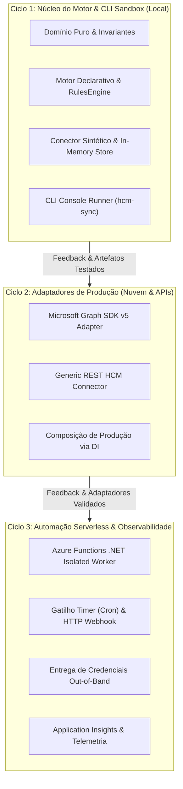

# Macro Execution Roadmap: HCM → Microsoft Entra ID Provisioning Engine

- **Projeto:** HCM to Microsoft Entra ID Lifecycle & Provisioning Automation
- **Status:** Ciclos 1, 2, 3, Hardening & Arquitetura NuGet de 2 Pacotes (v1.1.0) Concluídos e Validados (235 testes) | Produção & NuGet Ready
- **Arquitetura Base:** [`docs/superpowers/specs/2026-10-05-hcm-entra-id-provisioning-design.md`](docs/superpowers/specs/2026-10-05-hcm-entra-id-provisioning-design.md)
- **Runtime:** .NET 10 (`net10.0`), C# 14

---

## 1. Visão Geral & Estratégia de Entrega Iterativa

Este projeto adota uma abordagem de **engenharia orientada a marcos funcionais (Milestones)**. Em vez de implementar todos os subsistemas em um único plano extenso, o desenvolvimento é decomposto em **3 ciclos iterativos independentes e autocontidos**.

Cada ciclo entrega software 100% testado, compilável e executável. O encerramento de cada ciclo gera um conjunto concreto de artefatos e evidências de teste que retroalimentam o planejamento fino do ciclo seguinte.

---

## 2. Matriz dos Ciclos de Execução

| Ciclo | Nome / Foco | Entregável Funcional | Plano Detalhado | Status |
| :--- | :--- | :--- | :--- | :--- |
| **Ciclo 1** | **Núcleo do Motor & CLI Sandbox** | Engine de reconciliação em memória + CLI funcional (`hcm-sync`) operando sobre 6 cenários de RH. Zero dependência externa. | [`docs/superpowers/plans/2026-10-05-hcm-entra-id-cycle-1-core-engine.md`](docs/superpowers/plans/2026-10-05-hcm-entra-id-cycle-1-core-engine.md) | **Concluído e Validado (123 testes)** |
| **Ciclo 2** | **Adaptadores de Produção (Graph & REST)** | Implementação real do `IIdentityStore` (Microsoft Graph v5 via Managed Identity) e `IHcmConnector` (REST HTTP resiliente). | [`docs/superpowers/plans/2026-10-06-cycle-2-production-adapters.md`](docs/superpowers/plans/2026-10-06-cycle-2-production-adapters.md) | **Concluído e Validado (159 testes)** |
| **Ciclo 3** | **Automação Serverless & Observabilidade** | Host Azure Functions (.NET Isolated), agendamento cron, webhook manual, envio seguro de credenciais e App Insights. | [`docs/superpowers/plans/2026-10-06-cycle-3-serverless-functions.md`](docs/superpowers/plans/2026-10-06-cycle-3-serverless-functions.md) | **Concluído e Validado (173 testes)** |
| **Hardening & NuGet (v1.1.0)** | **Two-Stage Parallel Batching & Empacotamento NuGet** | Refatoração Two-Stage Parallel Batching no Graph Adapter, paginação anti-ciclos nos casos de uso, leitura mascarada de senhas e distribuição NuGet (`Domain`, `Application`, `Infrastructure`). | [`docs/superpowers/plans/2026-10-07-graph-batch-two-stage-and-nuget-packaging.md`](docs/superpowers/plans/2026-10-07-graph-batch-two-stage-and-nuget-packaging.md) | **Concluído e Validado (209 testes)** |
| **Arquitetura NuGet de 2 Pacotes (v1.1.0)** | **Consolidação dos 2 Pacotes Oficiais & Admin CLI SDK** | Publicação isolada de 2 pacotes oficiais de alto nível (`HcmIdentityProvisioning` para o core engine e `HcmIdentityProvisioning.Admin` para o CLI SDK administrativo). Camadas internas `Domain` e `Application` desabilitadas para publicação (`IsPackable: false`). CLI thin host runner e 235 testes automatizados aprovados. | [`docs/superpowers/plans/2026-10-08-hcm-provisioning-and-admin-nuget-architecture.md`](docs/superpowers/plans/2026-10-08-hcm-provisioning-and-admin-nuget-architecture.md) | **Concluído e Validado (235 testes)** |

---

## 3. Detalhamento dos Ciclos

### Ciclo 1: Núcleo do Motor & CLI Sandbox (Local & Autossuficiente)
- **Objetivo:** Estabelecer o coração das regras de negócio, invariantes de domínio e reconciliação declarativa, validando tudo localmente em milissegundos.
- **Escopo Técnico:**
  - Solução e projetos: `Domain`, `Application`, `Infrastructure`, `Cli` e suítes de testes (`Domain.Tests`, `Application.Tests`, `Infrastructure.Tests`).
  - Value Objects: `EmployeeId`, `UserPrincipalName` (com sanitização de acentos e resolução de homônimos) e `EmailAddress`.
  - Entidades: `Employee`, `EntraUser`, `ManagedGroup` e hierarquia de `DeltaAction`.
  - Portas do Domínio: `IHcmConnector`, `IIdentityStore`, `IRulesEngine`, `ICredentialDeliveryService`, `ICircuitBreaker`, `ISecurePasswordGenerator`.
  - Adaptadores Locais: `MicrosoftRulesEngineAdapter` (`rules.json`), `SyntheticHcmConnector` (`synthetic-employees.json`), `InMemoryIdentityStore` thread-safe e `DisablementCircuitBreaker`.
  - Reconciliação Declarativa: `IdentityReconciliationService`, `ReconcileBatchUseCase`, `DryRunAuditUseCase`.
  - CLI: `System.CommandLine` com comandos `sync` (`--dry-run`, `--json-logs`) e `validate-rules`.
- **Critério de Saída (DoD - Definition of Done):**
  - Todos os testes unitários e de integração verdes (`dotnet test`).
  - Teste E2E demonstrando reconciliação dos 6 cenários de RH em < 1 segundo e com idempotência estrita (segunda execução = 0 mutações).
  - CLI executável no terminal via `dotnet run --project src/HcmIdentityProvisioning.Cli -- sync`.

---

### Ciclo 2: Adaptadores de Produção (Microsoft Graph SDK v5 & Generic REST HCM)
- **Objetivo:** Conectar o motor validado no Ciclo 1 à infraestrutura real de nuvem (Microsoft Entra ID) e sistemas de RH externos.
- **Escopo Técnico:**
  - `EntraIdGraphAdapter : IIdentityStore`:
    - Microsoft Graph SDK v5+ autenticado via Azure Managed Identity (`DefaultAzureCredential`).
    - Consulta em lote de usuários via `$filter=employeeId in (...)`.
    - Respeito estrito à fronteira de grupos gerenciados (`grp-iam-*`) e política de grupos inexistentes (`WARNING_MANAGED_GROUP_NOT_FOUND`).
    - Envio de mutações em lotes da Graph API (`BatchRequestContentCollection`, até 20 operações por payload).
  - `GenericRestHcmConnector : IHcmConnector`:
    - Conector HTTP resiliente utilizando `IHttpClientFactory` com paginação nativa e tratamento de retry/backoff.
  - Testes de integração de infraestrutura com mocks do Graph SDK e HTTP Handlers.
  - Extensões de DI em `ServiceCollectionExtensions` para injeção limpa de produção.
- **Insumos Requeridos do Ciclo 1:**
  - As portas `IIdentityStore` e `IHcmConnector` estáveis e testadas.
  - A suite de testes de conciliação comprovada para servir de benchmark de regressão.
- **Critério de Saída (DoD):**
  - Suíte de testes de integração de adaptadores verde.
  - CLI capaz de receber parâmetros para apontar para o Entra ID ou API REST real caso credenciais estejam presentes.

---

### Ciclo 3: Automação Serverless (Azure Functions) & Observabilidade
- **Objetivo:** Empacotar a solução para execução serverless contínua no Azure com telemetria corporativa e entrega de credenciais.
- **Escopo Técnico:**
  - Projeto `HcmIdentityProvisioning.Functions` configurado em .NET 10 Isolated Worker.
  - `SyncTimerFunction`: gatilho de agendamento CRON (ex: a cada 30 minutos) chamando `ReconcileBatchUseCase`.
  - `SyncHttpFunction`: endpoint HTTP autenticado (`POST /api/sync?dry_run=true`) para acionamento sob demanda ou webhooks de RH.
  - `EmailCredentialDeliveryService : ICredentialDeliveryService`: envio out-of-band de primeiro acesso quando e-mail estiver presente em `ExtendedAttributes`.
  - Observabilidade e Telemetria:
    - Integração nativa com Azure Application Insights / Azure Monitor (`customDimensions`).
    - Alertas críticos automáticos em caso de disparo do Circuit Breaker (`CRITICAL_AUDIT_BREAKER_TRIPPED`).
- **Insumos Requeridos do Ciclo 2:**
  - Adaptadores `EntraIdGraphAdapter` e `GenericRestHcmConnector` testados e registrados em DI.
- **Critério de Saída (DoD):**
  - Azure Functions compilando e executando localmente via Azure Functions Core Tools ou testes unitários de funções.
  - Disparos agendados e HTTP testados.
  - Documentação final de deploy e configuração de app settings.

---

### Arquitetura NuGet de 2 Pacotes: Core Engine (`HcmIdentityProvisioning`) & Admin SDK (`HcmIdentityProvisioning.Admin`)
- **Objetivo:** Estabelecer uma arquitetura de distribuição limpa, desacoplada e orientada à intenção via 2 pacotes oficiais NuGet na versão `1.1.0`. Separar as preocupações de infraestrutura corporativa do ferramental de linha de comando, encapsular a topologia interna de camadas (`Domain` e `Application`) e habilitar extensibilidade de ferramentas administrativas por terceiros.
- **Escopo Técnico:**
  - Extração da biblioteca de classe `HcmIdentityProvisioning.Admin` (`net10.0`), encapsulando os builders de linha de comando (`AdminCliBuilder`), handlers, opções e contratos de console.
  - Conversão do projeto `HcmIdentityProvisioning.Cli` em um executável console minimalista ("thin runner"), consumindo `HcmIdentityProvisioning.Admin`.
  - Configuração do pacote oficial central:
    - `HcmIdentityProvisioning` (originado de `src/HcmIdentityProvisioning.Infrastructure`): Contém o core provisioning engine, conectores, adapters de resiliência e conciliação de identidade. `<PackageId>HcmIdentityProvisioning</PackageId>` e `<IsPackable>true</IsPackable>`.
  - Configuração do pacote oficial de administração:
    - `HcmIdentityProvisioning.Admin` (originado de `src/HcmIdentityProvisioning.Admin`): SDK reutilizável para tooling e automações CLI. `<PackageId>HcmIdentityProvisioning.Admin</PackageId>` e `<IsPackable>true</IsPackable>`.
  - Encapsulamento interno:
    - `Domain.csproj` e `Application.csproj` configurados com `<IsPackable>false</IsPackable>`, garantindo que detalhes internos de Clean Architecture permaneçam protegidos contra dispersão no feed público de pacotes.
    - `Cli.csproj` e `Functions.csproj` configurados com `<IsPackable>false</IsPackable>`.
  - Suíte de testes expandida para 235 testes automatizados com cobertura total do novo SDK e comandos administrativos (`Admin.Tests`).
- **Critério de Saída (DoD):**
  - `dotnet pack -c Release` gerando estritamente os 2 pacotes oficiais (`HcmIdentityProvisioning.1.1.0.nupkg` e `HcmIdentityProvisioning.Admin.1.1.0.nupkg`).
  - Suíte completa de testes aprovada com 235 testes verdes (`dotnet test`).
- **Resolução de Empacotamento NuGet (NU1101 & NU5104) & Estabilização de Testes:**
  - Publicação das 4 bibliotecas no ecossistema NuGet (`HcmIdentityProvisioning`, `HcmIdentityProvisioning.Admin`, `HcmIdentityProvisioning.Domain`, `HcmIdentityProvisioning.Application`) na versão `1.1.0`. O consumidor final continua instalando unicamente `HcmIdentityProvisioning` para serviços de provisionamento ou `HcmIdentityProvisioning.Admin` para CLIs corporativos, com restauração transparente de dependências sem erros `NU1101`.
  - Supressão do warning `NU5104` em `HcmIdentityProvisioning.Admin` decorrente da pré-versão do `System.CommandLine`.
  - Estabilização do teste de integração E2E `FullReconciliationCycle_ExecutesInSubsecond_AndMaintainsIdempotency` sob concorrência e carga de CPU.

---

## 4. Protocolo de Retroalimentação (Feedback Loop entre Ciclos)

Ao término de qualquer ciclo:
1. **Verificação de Evidências:** Rodar `dotnet test` e registrar os resultados de cobertura e tempo de execução.
2. **Revisão de Aprendizados:** Avaliar se alguma invariante ou interface sofreu ajustes práticos durante a implementação.
3. **Planejamento do Ciclo Seguinte:**
   - Um novo agente ou sessão consulta este documento (`execution-roadmap.md`) e a spec técnica (`docs/superpowers/specs/2026-10-05-hcm-entra-id-provisioning-design.md`).
   - Usa o estado real do código no repositório como contexto comprovado.
   - Invoca a skill `writing-plans` para escrever o plano do próximo ciclo (ex: `docs/superpowers/plans/YYYY-MM-DD-cycle-2-production-adapters.md`).
   - Executa o próximo ciclo com foco e contexto preservados.

---

## 5. Rastreabilidade de Arquivos

| Documento | Caminho | Finalidade |
| :--- | :--- | :--- |
| **Especificação Arquitetural Macro** | [`docs/superpowers/specs/2026-10-05-hcm-entra-id-provisioning-design.md`](docs/superpowers/specs/2026-10-05-hcm-entra-id-provisioning-design.md) | Fonte da verdade da arquitetura, modelo de domínio e segurança. |
| **Especificação Técnica - Ciclo 2** | [`docs/superpowers/specs/2026-10-06-cycle-2-production-adapters-design.md`](docs/superpowers/specs/2026-10-06-cycle-2-production-adapters-design.md) | Design técnico detalhado dos adaptadores de produção (Graph SDK & REST). |
| **Especificação Técnica - Ciclo 3** | [`docs/superpowers/specs/2026-10-06-cycle-3-serverless-functions-design.md`](docs/superpowers/specs/2026-10-06-cycle-3-serverless-functions-design.md) | Design técnico de Azure Functions, entrega de credenciais e observabilidade. |
| **Macro Roadmap (Este Doc)** | [`docs/superpowers/execution-roadmap.md`](docs/superpowers/execution-roadmap.md) | Visão macro de alto nível, divisão dos ciclos e protocolo de continuidade. |
| **Plano de Implementação - Ciclo 1** | [`docs/superpowers/plans/2026-10-05-hcm-entra-id-cycle-1-core-engine.md`](docs/superpowers/plans/2026-10-05-hcm-entra-id-cycle-1-core-engine.md) | Plano passo a passo para execução imediata do Ciclo 1. |
| **Plano de Implementação - Ciclo 2** | [`docs/superpowers/plans/2026-10-06-cycle-2-production-adapters.md`](docs/superpowers/plans/2026-10-06-cycle-2-production-adapters.md) | Plano fino para os adaptadores de produção. |
| **Plano de Implementação - Ciclo 3** | [`docs/superpowers/plans/2026-10-06-cycle-3-serverless-functions.md`](docs/superpowers/plans/2026-10-06-cycle-3-serverless-functions.md) | Plano fino para Azure Functions, telemetria e validação final. |
| **Especificação Técnica - Hardening & NuGet** | [`docs/superpowers/specs/2026-10-07-graph-batch-two-stage-and-nuget-packaging-design.md`](docs/superpowers/specs/2026-10-07-graph-batch-two-stage-and-nuget-packaging-design.md) | Design de Two-Stage Parallel Batching, paginação defensiva, CLI masking e distribuição NuGet. |
| **Plano de Implementação - Hardening & NuGet** | [`docs/superpowers/plans/2026-10-07-graph-batch-two-stage-and-nuget-packaging.md`](docs/superpowers/plans/2026-10-07-graph-batch-two-stage-and-nuget-packaging.md) | Plano fino de execução para Two-Stage Parallel Batching e empacotamento NuGet v1.1.0. |
| **Especificação Técnica - Arquitetura NuGet 2 Pacotes** | [`docs/superpowers/specs/2026-10-08-hcm-provisioning-and-admin-nuget-architecture-design.md`](docs/superpowers/specs/2026-10-08-hcm-provisioning-and-admin-nuget-architecture-design.md) | Design arquitetural da separação em 2 pacotes oficiais (`HcmIdentityProvisioning` e `HcmIdentityProvisioning.Admin`). |
| **Plano de Implementação - Arquitetura NuGet 2 Pacotes** | [`docs/superpowers/plans/2026-10-08-hcm-provisioning-and-admin-nuget-architecture.md`](docs/superpowers/plans/2026-10-08-hcm-provisioning-and-admin-nuget-architecture.md) | Plano fino de execução para extração do Admin SDK, empacotamento oficial e 235 testes. |
