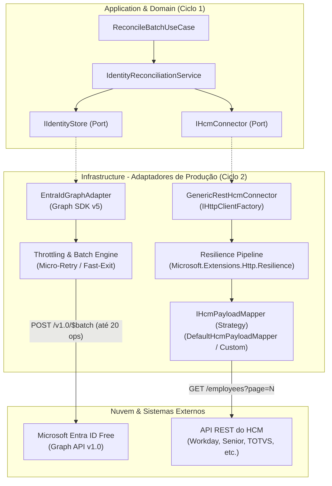

# Technical Design: Ciclo 2 - Adaptadores de Produção (Microsoft Graph SDK v5 & Generic REST HCM)

- **Autor:** Security Engineering & IAM
- **Data:** 2026-10-06
- **Status:** Aprovado para Implementação
- **Target Runtime:** .NET 10 (`net10.0`), C# 14 / Azure Functions (.NET Isolated Worker)
- **Target Ecosystem:** Microsoft Entra ID (Free tier compatible, zero P1/P2 dependency) & Generic HCM REST APIs
- **Artefato Base:** [`docs/superpowers/specs/2026-10-05-hcm-entra-id-provisioning-design.md`](docs/superpowers/specs/2026-10-05-hcm-entra-id-provisioning-design.md)
- **Macro Roadmap:** [`docs/superpowers/execution-roadmap.md`](docs/superpowers/execution-roadmap.md)

---

## 1. Visão Executiva & Contexto

No **Ciclo 1**, o motor de governança de identidades e reconciliação declarativa foi estabelecido e validado com 123 testes automatizados (100% passando em subsegundos), cobrindo os 6 cenários de ciclo de vida de RH (Joiner, Mover, Leaver, Homônimos, Diacríticos e Idempotência) e um utilitário CLI sandbox autossuficiente operando em memória.

O **Ciclo 2** conecta esse núcleo a serviços e infraestruturas de nuvem reais através de dois adaptadores de produção de alta resiliência:
1. **`EntraIdGraphAdapter : IIdentityStore`**: Implementação real que se comunica com o Microsoft Entra ID utilizando o **Microsoft Graph SDK v5+** e autenticação via `Azure.Identity` (`DefaultAzureCredential`).
2. **`GenericRestHcmConnector : IHcmConnector`**: Conector HTTP resiliente utilizando `IHttpClientFactory` e `Microsoft.Extensions.Http.Resilience` (Polly v8), com arquitetura desacoplada baseada no padrão Strategy (`IHcmPayloadMapper`) para permitir adaptação imediata a qualquer API de RH (Workday, TOTVS Protheus, Senior Sistemas, BambooHR, ADP ou serviços internos).

Ambos os adaptadores são expostos como módulos de Injeção de Dependência em `HcmIdentityProvisioning.Infrastructure`, mantendo o domínio puro e o caso de uso totalmente desacoplados de bibliotecas externas.

---

## 2. Princípios Arquiteturais & Diretrizes Especiais

1. **Compatibilidade com Microsoft Entra ID Free (Zero Dependência de P1/P2):**
   - O provisionamento automático nativo da nuvem no Entra ID normalmente exige licenças premium (P1/P2/Governance) e SCIM inbound. Esta solução opera diretamente sobre as APIs v1.0 do Microsoft Graph disponíveis no tier gratuito do Entra ID.
2. **Arquitetura Anti-Throttling & Otimização de Resource Units (RUs):**
   - Uso sistemático de `$select` cirúrgico em consultas GET (reduz o custo de Resource Units de 2 para 1 por chamada).
   - Agrupamento de mutações em lotes JSON (`$batch`) de até 20 operações por payload.
   - Particionamento de filtros OData em chunks de até 15 IDs de colaboradores para prevenir URLs longas e erros 400 Bad Request.
   - Pré-carregamento (prefetch) dos grupos gerenciados uma única vez por execução.
3. **Estratégia Serverless de Fast-Exit (Equilíbrio entre Throttling e Cota Azure Functions):**
   - No caminho feliz (99% das execuções em empresas de pequeno/médio porte), a execução ocorre sem tempos mortos ou pausas artificiais, concluindo em poucos segundos e minimizando o consumo de GB-segundos da cota do Azure Functions.
   - Se a Microsoft Graph API responder com `HTTP 429 Too Many Requests`:
     - **Micro-Retry ($\le 5\text{s}$):** Se o header `Retry-After` for $\le 5$ segundos, aguarda e retenta apenas as sub-requisições afetadas em um novo lote (máximo de 1 tentativa).
     - **Fast-Exit ($> 5\text{s}$ ou falha persistente):** Se `Retry-After > 5` segundos (ex: 15s, 60s, 2min), o adaptador **não fica ocioso na memória do Azure Functions**. Ele emite log estruturado de aviso (`WARNING_GRAPH_THROTTLE_FAST_EXIT`) e encerra o ciclo imediatamente em milissegundos. No próximo ciclo agendado (ex: 30 minutos depois), a reconciliação roda novamente e, graças à **idempotência estrita** do motor, o que já foi aplicado torna-se NO-OP instantâneo (0 mutações) e o que faltou é processado normalmente.
4. **Desacoplamento de Schema para Comunidade Open-Source (Strategy Pattern):**
   - APIs de RH possuem formatos heterogêneos de JSON e parâmetros de paginação. O transporte HTTP resiliente é isolado do mapeamento de dados através de `IHcmPayloadMapper`, com uma implementação padrão pronta (`DefaultHcmPayloadMapper`) e total facilidade para desenvolvedores plugarem seus próprios mappers.

---

## 3. Diagrama Geral de Componentes e Fluxo de Dados



---

## 4. Detalhamento Técnico: `EntraIdGraphAdapter : IIdentityStore`

### 4.1 Pacotes NuGet & Dependências
- `Microsoft.Graph` (versão 5.x)
- `Azure.Identity` (versão 1.13+)

### 4.2 Configurações (`EntraIdGraphOptions`)
```csharp
public sealed class EntraIdGraphOptions
{
    public string TenantDomain { get; set; } = string.Empty;
    public string ManagedGroupPrefix { get; set; } = "grp-iam-";
    public int MaxBatchSize { get; set; } = 20;
    public int FilterChunkSize { get; set; } = 15;
    public int MaxImmediateRetryDelaySeconds { get; set; } = 5;
    public TokenCredential? CustomCredential { get; set; }
}
```

### 4.3 Inicialização do Cliente
```csharp
var credential = options.CustomCredential ?? new DefaultAzureCredential();
var graphClient = new GraphServiceClient(credential, new[] { "https://graph.microsoft.com/.default" });
```

### 4.4 Implementação dos Métodos de `IIdentityStore`

#### 1. `GetManagedGroupsAsync(CancellationToken ct)`
- **Endpoint:** `GET /v1.0/groups?$filter=startswith(displayName, '{ManagedGroupPrefix}')&$select=id,displayName`
- **Operação:** Consulta todos os grupos de segurança sob governança uma única vez por execução.
- **Resultado:** Dicionário `IReadOnlyDictionary<string, ManagedGroup>` com `StringComparer.OrdinalIgnoreCase`.

#### 2. `IsUserPrincipalNameAvailableAsync(UserPrincipalName upn, CancellationToken ct)`
- **Endpoint:** `GET /v1.0/users?$filter=userPrincipalName eq '{upn.Value}'&$select=id`
- **Otimização:** `$select=id` minimiza o custo para apenas 1 Resource Unit no Entra ID.
- **Lógica:**
  - Se `value` estiver vazio (`count == 0`): retorna `true` (UPN livre para novo colaborador).
  - Se `value` contiver elementos: retorna `false` (UPN ocupado; motor aciona regra de sufixo incremental de homônimos).

#### 3. `GetUsersByEmployeeIdsAsync(IEnumerable<EmployeeId> employeeIds, CancellationToken ct)`
- **Chunking OData:** Divide a coleção de IDs em blocos de até 15 IDs (`FilterChunkSize`).
- **Endpoint por Bloco:**  
  `GET /v1.0/users?$filter=employeeId in ('id1', 'id2', ...)&$select=id,employeeId,userPrincipalName,displayName,accountEnabled`
- **Resolução de Grupos:**
  - Para os usuários retornados, consulta as associações a grupos gerenciados (via `transitiveMemberOf` ou `/memberOf?$select=id`).
  - Filtra rigorosamente os IDs de grupos que pertencem ao conjunto conhecido de `ManagedGroupScope` (`grp-iam-*`).
  - Grupos fora do prefixo de governança (ex: administradores do tenant, grupos externos) são descartados da representação, garantindo blast radius zero.
- **Resultado:** `IReadOnlyDictionary<EmployeeId, EntraUser>`.

#### 4. `ApplyBatchMutationsAsync(IEnumerable<DeltaAction> actions, CancellationToken ct)`
Empacota a hierarquia de `DeltaAction` em lotes JSON (`$batch`) de até 20 operações (`BatchRequestContentCollection`):

| Ação de Domínio | Método HTTP & URL no `$batch` | Payload JSON / Parâmetros |
| :--- | :--- | :--- |
| `CreateUserAction` | `POST /users` | `{ accountEnabled: true, displayName, userPrincipalName, mailNickname, employeeId, passwordProfile: { forceChangePasswordNextSignIn: true, password } }` |
| `UpdateDisplayNameAction` | `PATCH /users/{id}` | `{ displayName }` |
| `EnableAccountAction` | `PATCH /users/{id}` | `{ accountEnabled: true }` |
| `DisableAccountAction` | `PATCH /users/{id}` | `{ accountEnabled: false }` |
| `RevokeSessionsAction` | `POST /users/{id}/revokeSignInSessions` | `{}` |
| `AddGroupMemberAction` | `POST /groups/{groupId}/members/$ref` | `{"@odata.id": "https://graph.microsoft.com/v1.0/directoryObjects/{userId}"}` |
| `RemoveGroupMemberAction` | `DELETE /groups/{groupId}/members/{userId}/$ref` | Sem payload |

### 4.5 Motor de Resposta Granular e Fast-Exit Throttling
Como o Graph SDK não retenta automaticamente requisições 429 contidas dentro de payloads `$batch`:
1. O adaptador processa individualmente o status HTTP de cada sub-resposta:
   - **`200`, `201`, `204`:** Sucesso confirmado.
   - **`400` / `409` em `AddGroupMemberAction`:** "Member already exists" $\implies$ aceito como sucesso idempotente.
   - **`404` em `RemoveGroupMemberAction`:** "Not a member" $\implies$ aceito como sucesso idempotente.
   - **`429 Too Many Requests`:**
     - Extrai o header `Retry-After` da sub-resposta.
     - **Cenário A (`Retry-After <= MaxImmediateRetryDelaySeconds`, ex: $\le 5$s):**  
       Executa micro-pausa de rede via `Task.Delay(retryAfter, ct)` e submete um novo `$batch` apenas com os itens afetados (máximo de 1 retentativa).
     - **Cenário B (`Retry-After > MaxImmediateRetryDelaySeconds` ou falha reincidente):**  
       Aciona **Fast-Exit**. Loga `WARNING_GRAPH_THROTTLE_FAST_EXIT` e interrompe imediatamente a execução do lote restante. A Azure Function encerra sem bloquear recursos, confiando na reconciliação idempotente do próximo ciclo agendado.
   - **Outros Códigos (5xx, etc.):** Registra `ERROR_GRAPH_SUBREQUEST_FAILED` com detalhes do erro OData.

---

## 5. Detalhamento Técnico: `GenericRestHcmConnector : IHcmConnector`

### 5.1 Pacotes NuGet & Dependências
- `Microsoft.Extensions.Http.Resilience` (versão 10.x / 9.x para .NET 10)
- `Microsoft.Extensions.Options`

### 5.2 Estratégia de Mapeamento Aberta (`IHcmPayloadMapper`)
```csharp
public interface IHcmPayloadMapper
{
    string BuildPageUri(string endpoint, int pageNumber, int pageSize);

    Task<PagedResult<Employee>> MapResponseAsync(
        HttpResponseMessage response,
        int pageNumber,
        int pageSize,
        CancellationToken ct = default);
}
```

### 5.3 Implementação Padrão (`DefaultHcmPayloadMapper`)
- **URI:** `{endpoint}?pageNumber={pageNumber}&pageSize={pageSize}`
- **Estrutura JSON:**
```json
{
  "items": [
    {
      "id": "EMP-001",
      "fullName": "João Silva",
      "status": "Active",
      "department": "Tecnologia",
      "jobTitle": "Engenheiro de Software",
      "extendedAttributes": {
        "email": "joao.silva@personal.com"
      }
    }
  ],
  "pageNumber": 1,
  "pageSize": 50,
  "totalCount": 100
}
```
- **Validação de Domínio:** Cada registro é instanciado garantindo a validade de `EmployeeId` e `EmployeeStatus`. Se o status for `"Active"`, projeta `EmployeeStatus.Active`; caso contrário, `EmployeeStatus.Inactive`.

### 5.4 Configurações de Conectividade (`RestHcmConnectorOptions`)
```csharp
public sealed class RestHcmConnectorOptions
{
    public string BaseUrl { get; set; } = string.Empty;
    public string Endpoint { get; set; } = "/api/v1/employees";
    public HcmAuthScheme AuthScheme { get; set; } = HcmAuthScheme.Bearer;
    public string? BearerToken { get; set; }
    public string? ApiKey { get; set; }
    public string ApiKeyHeaderName { get; set; } = "X-Api-Key";
    public int TimeoutSeconds { get; set; } = 30;
    public Dictionary<string, string> CustomHeaders { get; set; } = new();
}

public enum HcmAuthScheme
{
    None,
    Bearer,
    ApiKey,
    Basic
}
```

### 5.5 Pipeline de Resiliência HTTP (.NET 10 Polly v8)
Configurado automaticamente no named client via `AddResilienceHandler`:
1. **Retry Policy:** 3 tentativas com backoff exponencial decorrelacionado (jitter) para erros 5xx, 408 e falhas transitórias de socket/DNS.
2. **Circuit Breaker:** Desarma se 50% das requisições ao endpoint de RH falharem em uma janela de amostragem de 30 segundos, suspendendo chamadas desnecessárias até a API se recuperar.
3. **Timeout Geral:** Limite de 30 segundos por requisição.

---

## 6. Composição na Injeção de Dependência (`ServiceCollectionExtensions`)

A camada `Infrastructure` expõe métodos de extensão limpos e autocontidos:

```csharp
// Registro do Microsoft Graph Adapter de Produção
public static IServiceCollection AddEntraIdGraphAdapter(
    this IServiceCollection services,
    Action<EntraIdGraphOptions> configureOptions);

// Registro do Conector REST com Mapper Padrão
public static IServiceCollection AddGenericRestHcmConnector(
    this IServiceCollection services,
    Action<RestHcmConnectorOptions> configureOptions);

// Registro do Conector REST com Mapper Customizado (Open-Source Extensibility)
public static IServiceCollection AddGenericRestHcmConnector<TMapper>(
    this IServiceCollection services,
    Action<RestHcmConnectorOptions> configureOptions)
    where TMapper : class, IHcmPayloadMapper;
```

---

## 7. Estratégia de Testes e Validação do Ciclo 2

Para manter a fidelidade e velocidade da suíte de testes (executando em subsegundos sem dependência de credenciais reais ou internet), criamos um **`MockHttpMessageHandler`** para simular as APIs da Microsoft e de RH:

### 7.1 Cenários de Teste Unitários e de Integração
1. **`EntraIdGraphAdapterTests`:**
   - `GetManagedGroupsAsync_FiltersOnlyManagedPrefix_CaseInsensitive`
   - `IsUserPrincipalNameAvailableAsync_WhenEmpty_ReturnsTrue_WithSelectId`
   - `IsUserPrincipalNameAvailableAsync_WhenExists_ReturnsFalse`
   - `GetUsersByEmployeeIdsAsync_SplitsIntoChunksOf15_AndFiltersManagedGroups`
   - `ApplyBatchMutationsAsync_BuildsValidBatchPayload_For7ActionTypes`
   - `ApplyBatchMutationsAsync_OnMicroRetryThrottle_RetriesFailedItem_Successfully`
   - `ApplyBatchMutationsAsync_OnLongThrottle_TriggersFastExit_WithoutBlocking`
   - `ApplyBatchMutationsAsync_ToleratesIdempotentGroupFailures_400_and_404`
2. **`GenericRestHcmConnectorTests`:**
   - `GetEmployeesPageAsync_WithDefaultMapper_DeserializesCorrectly`
   - `GetEmployeesPageAsync_InjectsBearerAuthHeader_Correctly`
   - `GetEmployeesPageAsync_WithCustomMapper_ProjectsLegacySchemaSuccessfully`
   - `GetEmployeesPageAsync_RetriesOnTransient503_ViaPollyPipeline`
3. **`FullProductionPipelineIntegrationTests`:**
   - Injeção completa via `AddEntraIdGraphAdapter` e `AddGenericRestHcmConnector`.
   - Execução do caso de uso `ReconcileBatchUseCase` simulando um ciclo completo com os 6 cenários de RH.

---

## 8. Critérios de Saída (Definition of Done - DoD)

1. [ ] **Build:** `dotnet build` compila a solução completa sem nenhum warning ou erro (`net10.0`).
2. [ ] **Zero Regressão:** Todos os 123 testes existentes do Ciclo 1 continuam 100% verdes.
3. [ ] **Cobertura do Ciclo 2:** Novos testes de integração cobrindo os adaptadores Graph e REST aprovados (meta: 150+ testes no total).
4. [ ] **Performance:** Toda a suíte de testes executa em menos de 2 segundos.
5. [ ] **Extensibilidade Validada:** Teste demonstrando implementação de um `IHcmPayloadMapper` customizado passando com sucesso.
