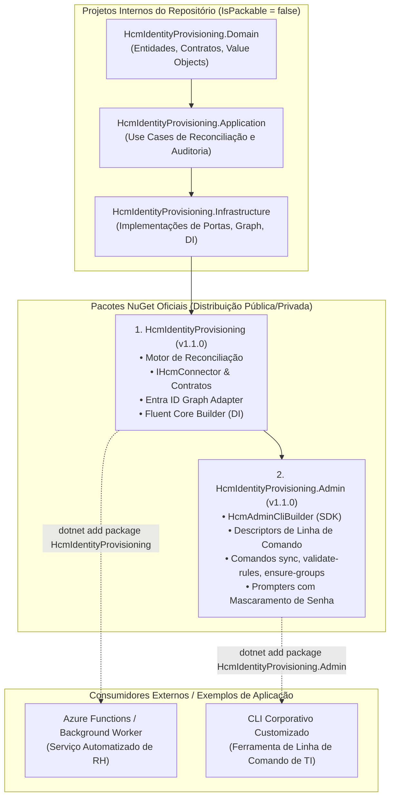

# Especificação Técnica: Arquitetura de Pacotes de Alto Nível e Extensibilidade (Provisioning Engine & Admin CLI SDK)

- **Documento:** Design Arquitetural de Empacotamento Orientado à Intenção
- **Data:** 2026-10-08
- **Status:** Aprovado para Planejamento
- **Versão Alvo:** `1.1.0`
- **Runtime:** .NET 10 (`net10.0`), C# 14 (`Nullable: enable`, `ImplicitUsings: enable`)

---

## 1. Visão Geral & Motivação Arquitetural

### 1.1. Contexto & Problema
Na versão anterior, as bibliotecas do núcleo foram preparadas para empacotamento com base na sua divisão em camadas internas de engenharia:
- `HcmIdentityProvisioning.Domain.nupkg`
- `HcmIdentityProvisioning.Application.nupkg`
- `HcmIdentityProvisioning.Infrastructure.nupkg`

Essa abordagem de **"Empacotar por Camada Técnica"** (*Package by Technical Layer*) introduz sérias falhas de experiência de desenvolvedor (DevEx) e vazamento de detalhes internos:
1. **Sobrecarga Cognitiva:** Consumidores externos que desejam apenas construir um serviço de sincronização ou implementar um conector proprietário (ex.: *Workday*, *Senior*, *SAP*, *Totvs*) são forçados a entender onde reside cada classe do motor (*Onion / Clean Architecture*).
2. **Dependências Incompletas:** `Domain` sozinho não possui motor de execução, serialização ou injeção de dependência. Ninguém instala apenas `Domain` ou apenas `Application`.
3. **Acoplamento do CLI Executável:** O projeto `HcmIdentityProvisioning.Cli` era um binário executável rígido (`OutputType: Exe`), impedindo que organizações compilassem suas próprias ferramentas de console administrativas reaproveitando a infraestrutura de linha de comando, comandos e tratamentos existentes.

### 1.2. Solução: "Empacotar por Intenção de Consumo" (*Package by Intent*)
O ecossistema público distribuído via NuGet passa a ter **exatamente 2 pacotes oficiais de alto nível**:

1. **`HcmIdentityProvisioning` (O Motor de Provisionamento):**
   Pacote *one-stop-shop* para quem constrói o **serviço operacional contínuo** (Azure Functions, Background Workers, Daemons, Web APIs). Expõe o contrato `IHcmConnector`, o motor declarativo de reconciliação, adaptadores de nuvem (Microsoft Entra ID) e injeção de dependência fluente via `IHcmProvisioningBuilder`.
2. **`HcmIdentityProvisioning.Admin` (O SDK & Ferramenta Administrativa):**
   Pacote para quem constrói **aplicações de governança e ferramentas humanas** (CLIs administrativos). Traz o `HcmAdminCliBuilder`, contratos de descriptors de conector (`IHcmConnectorCliDescriptor`), prompts mascarados e comandos prontos para o operador (`sync`, `validate-rules`, `ensure-groups`).

Internamente no repositório, o código-fonte permanece estritamente organizado em `Domain`, `Application` e `Infrastructure`, mas essas camadas recebem `<IsPackable>false</IsPackable>`, servindo como blocos internos de composição.

---

## 2. Topologia de Pacotes e Dependências



---

## 3. Especificação do Pacote 1: `HcmIdentityProvisioning` (Motor)

### 3.1. Responsabilidades & Conteúdo
O pacote `HcmIdentityProvisioning` consolida as bibliotecas de Domínio, Aplicação e Infraestrutura. Ele permite que qualquer aplicação hospedeira no ecossistema .NET execute o ciclo de reconciliação de identidades.

* **Portas & Contratos:**
  - `IHcmConnector`: Interface fundamental a ser implementada pelos desenvolvedores de conectores proprietários.
  - `Employee`, `EmployeeId`, `EmployeeStatus`, `UserPrincipalName`, `SyncReport`.
* **Casos de Uso Operacionais:**
  - `ReconcileBatchUseCase`: Sincronização em lote com proteção anti-ciclos e *Two-Stage Parallel Batching*.
  - `DryRunAuditUseCase`: Auditoria em memória sem mutações.
  - `EnsureManagedGroupsUseCase`: Garantia e provisionamento de grupos gerenciados no Entra ID.
* **Adaptadores Nativos:**
  - `EntraIdGraphAdapter`: Adaptador de produção para Microsoft Entra ID com tolerância a *throttling* (429) e conflitos (409).
  - `SyntheticHcmConnector`: Conector de fixture sintética para testes e homologação.
  - `GenericRestHcmConnector`: Conector HTTP REST genérico configurável.
  - `MicrosoftRulesEngineAdapter`: Avaliador declarativo de regras de associação a grupos.
  - `DisablementCircuitBreaker`: Disjuntor para proteção contra expurgos massivos acidentais.
  - `GraphEmailCredentialDeliveryService`: Envio seguro de credenciais temporárias.

### 3.2. Fluent Core Builder (`IHcmProvisioningBuilder`)

Localizado no namespace `HcmIdentityProvisioning.DependencyInjection`:

```csharp
namespace HcmIdentityProvisioning.DependencyInjection;

public interface IHcmProvisioningBuilder
{
    IServiceCollection Services { get; }
    SyncSettings Settings { get; }

    // 1. Registro de Conectores Proprietários
    IHcmProvisioningBuilder AddConnector<TConnector>() 
        where TConnector : class, IHcmConnector;

    IHcmProvisioningBuilder AddConnector<TConnector, TOptions>(Action<TOptions> configureOptions)
        where TConnector : class, IHcmConnector
        where TOptions : class;

    // 2. Conectores Nativos Integrados
    IHcmProvisioningBuilder AddSyntheticConnector(string fixturesPath);
    IHcmProvisioningBuilder AddGenericRestConnector(Action<RestHcmConnectorOptions>? configureOptions = null);

    // 3. Repositório de Identidades (Entra ID ou Memória)
    IHcmProvisioningBuilder AddEntraIdStore(Action<EntraIdGraphOptions>? configureOptions = null);
    IHcmProvisioningBuilder AddInMemoryStore(Action<InMemoryIdentityStore>? seedAction = null);

    // 4. Entrega de Senhas Out-of-Band
    IHcmProvisioningBuilder AddCredentialDelivery<TDelivery>() 
        where TDelivery : class, ICredentialDeliveryService;
        
    IHcmProvisioningBuilder AddGraphEmailCredentialDelivery(Action<GraphEmailOptions> configureOptions);
}
```

### 3.3. Ponto de Entrada de DI
```csharp
public static class ServiceCollectionExtensions
{
    public static IHcmProvisioningBuilder AddHcmProvisioning(
        this IServiceCollection services,
        SyncSettings settings,
        string rulesJsonPath)
    {
        services.AddHcmProvisioningCore(settings, rulesJsonPath);
        return new HcmProvisioningBuilder(services, settings);
    }
}
```

### 3.4. Exemplo de Consumo em Azure Functions
```csharp
// Program.cs em Azure Functions (.NET 10 Isolated Worker)
using HcmIdentityProvisioning.DependencyInjection;
using Microsoft.Extensions.Hosting;
using MyCompany.HcmConnectors.Workday;

var host = new HostBuilder()
    .ConfigureFunctionsWorkerDefaults()
    .ConfigureServices((ctx, services) =>
    {
        var settings = new SyncSettings { TenantDomain = "contoso.onmicrosoft.com" };

        services.AddHcmProvisioning(settings, "rules.json")
            .AddEntraIdStore(opts => opts.TenantDomain = "contoso.onmicrosoft.com")
            .AddConnector<WorkdayHcmConnector, WorkdayOptions>(opts =>
            {
                opts.BaseUrl = ctx.Configuration["Workday:ApiUrl"]!;
                opts.ClientId = ctx.Configuration["Workday:ClientId"]!;
            })
            .AddGraphEmailCredentialDelivery(opts =>
            {
                opts.SenderEmail = "no-reply@contoso.onmicrosoft.com";
            });
    })
    .Build();

await host.RunAsync();
```

---

## 4. Especificação do Pacote 2: `HcmIdentityProvisioning.Admin` (CLI SDK)

### 4.1. Responsabilidades & Conteúdo
O pacote `HcmIdentityProvisioning.Admin` empacota a infraestrutura necessária para construir utilitários de console e ferramentas administrativas de IAM.
- Depende diretamente de `HcmIdentityProvisioning` e de `System.CommandLine`.
- Não impõe quais conectores devem existir: permite conectar *Descriptors* proprietários.
- Fornece a montagem e injeção dos subcomandos padrão: `sync`, `validate-rules` e `ensure-groups`.
- Fornece prompters interativos de confirmação (`--yes` / `-y`) e leitura mascarada de senhas com `*`.

### 4.2. Contrato de Descriptor de Conector (`IHcmConnectorCliDescriptor`)

```csharp
namespace HcmIdentityProvisioning.Admin.Extensibility;

public interface IHcmConnectorCliDescriptor
{
    // Identificador único (ex: "workday", "totvs", "senior", "synthetic")
    string ConnectorKey { get; }

    // Descrição legível para help no terminal
    string Description { get; }

    // Opções de linha de comando específicas deste conector
    IReadOnlyList<Option> GetCliOptions();

    // Como registrar o conector na DI utilizando os valores parsed
    void ConfigureServices(IServiceCollection services, ParseResult parseResult, SyncCliOptions baseOptions);
}
```

### 4.3. O `HcmAdminCliBuilder`

```csharp
namespace HcmIdentityProvisioning.Admin;

public sealed class HcmAdminCliBuilder
{
    public static HcmAdminCliBuilder Create(string[] args);

    // Registro de descriptors de conectores
    public HcmAdminCliBuilder AddConnector<TDescriptor>() 
        where TDescriptor : IHcmConnectorCliDescriptor, new();
        
    public HcmAdminCliBuilder AddConnector(IHcmConnectorCliDescriptor descriptor);

    // Customizações diretas no host
    public HcmAdminCliBuilder ConfigureServices(Action<IServiceCollection> configureServices);
    public HcmAdminCliBuilder ConfigureRootCommand(Action<RootCommand> configureRootCommand);
    public HcmAdminCliBuilder AddCommand(Command customCommand);

    // Execução da aplicação de console
    public Task<int> RunAsync();
}
```

### 4.4. Exemplo de Consumo para Criar CLI Corporativo Próprio
```csharp
// Program.cs de um CLI customizado corporativo (ex: AcmeIdentityCli)
using HcmIdentityProvisioning.Admin;
using MyCompany.HcmConnectors.Workday;

var app = HcmAdminCliBuilder.Create(args)
    .AddConnector<WorkdayCliDescriptor>()
    .ConfigureRootCommand(root =>
    {
        root.Description = "ACME Corp - Workday to Microsoft Entra ID Sync & Administration Tool";
    });

return await app.RunAsync();
```

---

## 5. Estrutura de Projetos no Repositório & Empacotamento NuGet

### 5.1. Projetos Internos do Repositório
| Projeto | Tipo | IsPackable | Finalidade |
| :--- | :--- | :--- | :--- |
| `src/HcmIdentityProvisioning.Domain` | Class Library | `false` | Entidades puras, VOs, portas de domínio. |
| `src/HcmIdentityProvisioning.Application` | Class Library | `false` | Casos de uso de reconciliação, dry-run e auditoria. |
| `src/HcmIdentityProvisioning.Infrastructure` | Class Library | `true` (`PackageId: HcmIdentityProvisioning`) | Adaptadores Entra ID, DI Builder e empacotamento consolidado do core. |
| `src/HcmIdentityProvisioning.Admin` | Class Library | `true` (`PackageId: HcmIdentityProvisioning.Admin`) | Novo projeto de biblioteca do SDK de Admin e CLI. |
| `src/HcmIdentityProvisioning.Cli` | Console App | `false` | Ferramenta executável padrão do repositório (*dogfooding*). |
| `src/HcmIdentityProvisioning.Functions` | Functions App | `false` | Host executável de Azure Functions. |

### 5.2. Metadados dos 2 Pacotes Oficiais (`v1.1.0`)

#### Pacote 1: `HcmIdentityProvisioning`
Configurado no arquivo de projeto do motor:
```xml
<PropertyGroup>
  <PackageId>HcmIdentityProvisioning</PackageId>
  <Version>1.1.0</Version>
  <Authors>Hcm Identity Provisioning Team</Authors>
  <Description>Enterprise Microsoft Entra ID SCIM/HCM Provisioning & Reconciliation Engine</Description>
  <PackageLicenseExpression>MIT</PackageLicenseExpression>
  <RepositoryType>git</RepositoryType>
  <GeneratePackageOnBuild>false</GeneratePackageOnBuild>
  <IsPackable>true</IsPackable>
</PropertyGroup>
```

#### Pacote 2: `HcmIdentityProvisioning.Admin`
Configurado no novo projeto `src/HcmIdentityProvisioning.Admin/HcmIdentityProvisioning.Admin.csproj`:
```xml
<PropertyGroup>
  <PackageId>HcmIdentityProvisioning.Admin</PackageId>
  <Version>1.1.0</Version>
  <Authors>Hcm Identity Provisioning Team</Authors>
  <Description>Extensible Administration CLI SDK and Tooling for HCM Identity Provisioning Engine</Description>
  <PackageLicenseExpression>MIT</PackageLicenseExpression>
  <RepositoryType>git</RepositoryType>
  <GeneratePackageOnBuild>false</GeneratePackageOnBuild>
  <IsPackable>true</IsPackable>
</PropertyGroup>

<ItemGroup>
  <ProjectReference Include="..\HcmIdentityProvisioning.Infrastructure\HcmIdentityProvisioning.Infrastructure.csproj" />
  <PackageReference Include="System.CommandLine" Version="2.0.0-beta4.22272.1" />
</ItemGroup>
```

---

## 6. Estratégia de Testes e Validação

1. **`HcmProvisioningBuilderTests`:**
   - Teste de registro de conector customizado genérico.
   - Teste de injeção de opções tipadas.
   - Teste de resolução do `ReconcileBatchUseCase` a partir do builder fluente.
2. **`HcmAdminCliBuilderTests` & `ConnectorCliDescriptorTests`:**
   - Validação da extração de opções adicionais e montagem do comando `sync`.
   - Validação da injeção de dependência via descriptor.
   - Validação de adição de comandos personalizados ao `RootCommand`.
3. **Verificação de Regressão Integral:**
   - Todos os testes de `Domain.Tests`, `Application.Tests`, `Infrastructure.Tests`, `Cli.Tests` e `Functions.Tests` devem continuar passando (100% verde).
4. **Validação de Empacotamento (`dotnet pack -c Release`):**
   - Deve emitir **exatamente 2 pacotes** em `bin/Release/`:
     - `HcmIdentityProvisioning.1.1.0.nupkg`
     - `HcmIdentityProvisioning.Admin.1.1.0.nupkg`
   - Nenhum pacote isolado de `Domain` ou `Application` deve ser gerado.
